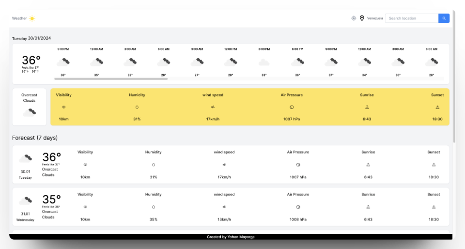
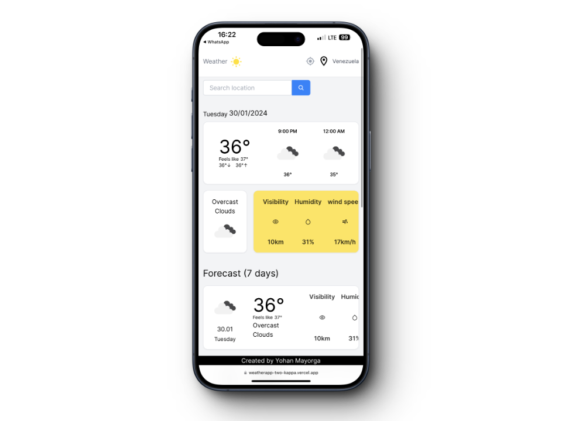

# Weather

Web application that allows you to check the weather in different cities around the world. The application uses the query to an API to obtain information in real time. It contains information about the current state of the weather you select, and the forecast for the next seven days.



## Used tools

```bash
HTML, CSS, JavaScript, NextJS, API, Tailwind.
```

## How does it work?

At the top of the page you will find the navigation bar, on the right side there is a search box, you can enter the city you want to consult and press the search button.

This web application is completely adaptable to phone and tablet formats..


## Learn More

This open source project is completely free to use, download and customize.

## Deploy on Vercel

The website is available at this [link.](https://weatherapp-obzz58ngc-yohanmayorgas-projects.vercel.app/)
